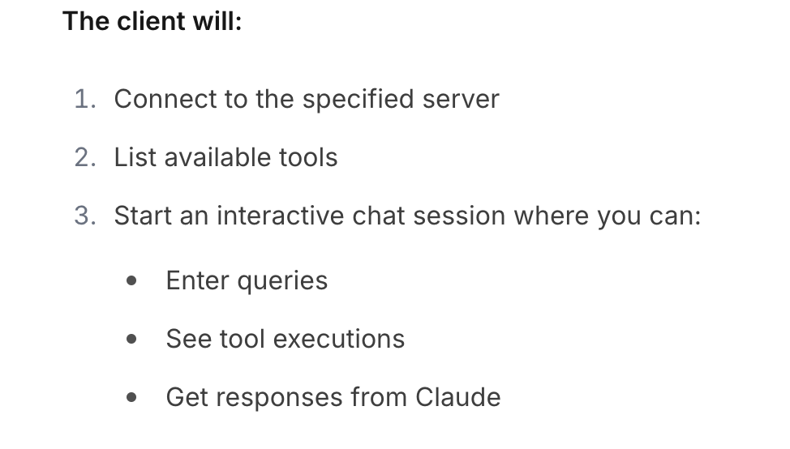

### client端开发 
- 环境：node > 17、LLM的接入Key
- 依赖：@anthropic-ai/sdk、@modelcontextprotocol/sdk
> step 1:  定义 MCPClient 包含：Client（客户端）、Anthropic(LLM)、StdioClientTransport（客户端输入/输出）、tools（注入后端server-list）
> step 2:  启动Client 

启动MCP-client端
> node build/index.js /Users/tangjiao/MCP/weather/build/index.js

### Core
> Client端有两个核心：1，创建LLM的连接 2、连接Servers
